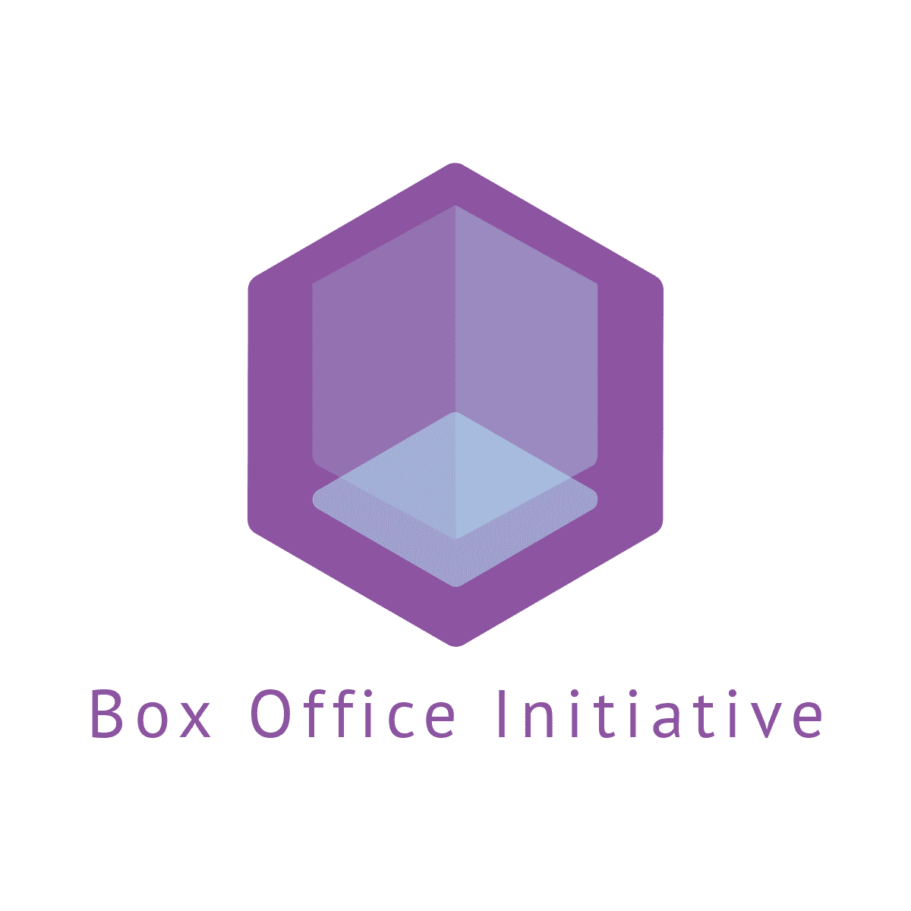

<p align="center">
  <a href="" rel="noopener">
 </a>
</p>

<h3 align="center">The Box Office Initiative Backend API</h3>

<div align="center">

  []()
  [](https://github.com/BoxOfficeInitiative/backend-api/issues)
  [](https://github.com/BoxOfficeInitiative/backend-api/pulls)
  [](/LICENSE)

</div>

---

<p align="center"> The backend API that supports the Box Office Initiative website.
    <br>
</p>

## 📝 Table of Contents
- [About](#about)
- [Getting Started](#getting_started)
- [Deployment](#deployment)
- [Usage](#usage)
- [Built Using](#built_using)
- [TODO](../TODO.md)
- [Contributing](../CONTRIBUTING.md)
- [Authors](#authors)
- [Acknowledgments](#acknowledgement)

## 🧐 About <a name = "about"></a>
Write about 1-2 paragraphs describing the purpose of your project.

## 🏁 Getting Started <a name = "getting_started"></a>
These instructions will get you a copy of the project up and running on your local machine for development and testing purposes. See [deployment](#deployment) for notes on how to deploy the project on a live system.

### Prerequisites

**Important:** this prerequisites apply only for the development environment.

First you need Docker:
* **Windows**: [Docker Desktop](https://www.docker.com/products/docker-desktop) 2.0+ on Windows 10 Pro/Enterprise. (Docker Toolbox is not supported. Windows container images are not supported.)
* **macOS**: [Docker Desktop](https://www.docker.com/products/docker-desktop) 2.0+.
* **Linux**: [Docker CE/EE](https://docs.docker.com/install/#supported-platforms) 18.06+ and [Docker Compose](https://docs.docker.com/compose/install) 1.21+. (The Ubuntu snap package is not supported.)

You will also need [Visual Studio Code](https://code.visualstudio.com/) with the [Visual Studio Code Remote - Containers](https://marketplace.visualstudio.com/items?itemName=ms-vscode-remote.remote-containers) extension.

And obviously, [git](https://git-scm.com/downloads).

### Installing
1. Clone this repository:

    ```bash
    git clone https://github.com/BoxOfficeInitiative/backend-api
    ```

2. Open the folder `backend-api` with VSCode:

    ```bash
    code backend-api
    ```
    Or just open it from the `File -> Open Folder` option in the VSCode menu.

3. Click on the quick actions Status Bar item in the lower left corner of the window, or press <kbd>F1</kbd>:

    </a>

4. Select **Remote-Containers: Open Folder in Container...** from the command list that appears, and open the root folder of the project you just cloned.

    The window will then reload, but since the container does not exist yet, VSCode will create one. This may take some time, and a progress notification will provide status updates. Fortunately, this step isn't necessary the next time you open the folder since the container will already exist.

    </a>

5. Press <kbd>F5</kbd> to start the development server. You can now visit: [http://localhost](http://localhost)

### Advanced

This project can be run using only `docker-compose` and any other text editor.

1. Clone this repository:

    ```bash
    git clone https://github.com/BoxOfficeInitiative/backend-api
    ```

2. Go to the repo folder `backend-api`:

    ```bash
    cd backend-api
    ```

3. Build and start the containers:

    ```bash
    docker-compose build
    docker-compose up -d
    ```

4. You can now run commands within the containers using the exec directive. For example, to run the `dotnet` development server:

    ```bash
    docker-compose exec app dotnet run
    ```


## 🔧 Running the tests <a name = "tests"></a>
Explain how to run the automated tests for this system.

### Break down into end to end tests
Explain what these tests test and why

```
Give an example
```

### And coding style tests
Explain what these tests test and why

```
Give an example
```

## 🎈 Usage <a name="usage"></a>
Add notes about how to use the system.

## 🚀 Deployment <a name = "deployment"></a>
Add additional notes about how to deploy this on a live system.

## ⛏️ Built Using <a name = "built_using"></a>
- [.Net Core](https://dotnet.microsoft.com/download) - Server Framework
- [PostgreSQL](https://www.postgresql.org/) - Server Database
- [Docker](https://www.docker.com/) - Container Platform

## ✍️ Authors <a name = "authors"></a>
- [@xzaero](https://github.com/xzaero) - Backend Team Leader

See also the list of [contributors](https://github.com/BoxOfficeInitiative/backend-api/contributors) who participated in this project.

## 🎉 Acknowledgements <a name = "acknowledgement"></a>
- Hat tip to anyone whose code was used
- Inspiration
- References
